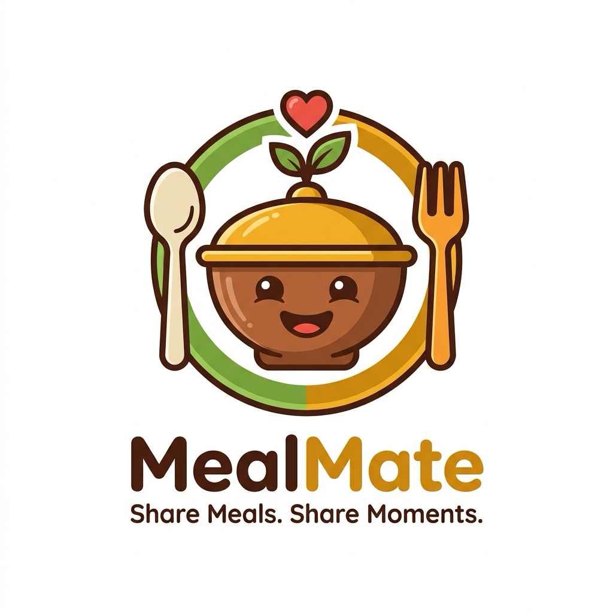

# MealMate

MealMate is a cross-platform mobile app for planning meals, browsing a shared food catalog, and coordinating with friends through groups. Built with **Expo**, **React Native**, and **Supabase**.

<p align="center">
  
</p>

## Features

### Discover (Home)
- Browse five meal categories as cards (Breakfast, Lunch, Dinner, Party, Get Together)
- Tap a category to view catalog dishes and add items to your personal menu
- Floating **+** button to add new dishes to the shared catalog

### My Menu
- View your menu for any date with a built-in date picker (defaults to today)
- Five category cards, each listing items you added for that day
- Empty categories show *"Nothing added yet"*

### Groups
- Create groups and invite members
- Group chat with real-time messages
- Activity notifications when members update their menus

### Profile
- Edit name, bio, and avatar
- View meal history filtered by category and date
- Sign in with Google OAuth

### Onboarding
- First-time users set their display name and bio after sign-up

## Tech Stack

| Layer | Technology |
|--------|------------|
| Framework | [Expo](https://expo.dev) SDK 54, React Native 0.81 |
| Language | TypeScript |
| Navigation | [Expo Router](https://docs.expo.dev/router/introduction/) (file-based) |
| Backend | [Supabase](https://supabase.com) (Auth, Postgres, Storage, Realtime) |
| State | [Zustand](https://zustand.docs.pmnd.rs/) (auth), [TanStack Query](https://tanstack.com/query) (server data) |
| Forms | React Hook Form + Zod |
| Icons | `@expo/vector-icons` (Ionicons) |

## Prerequisites

- [Node.js](https://nodejs.org/) 18+ and npm
- [Expo Go](https://expo.dev/go) on your device, or Xcode / Android Studio for native builds
- A [Supabase](https://supabase.com) project with Google OAuth configured

## Getting Started

### 1. Clone the repository

```bash
git clone https://github.com/YOUR_USERNAME/MealMate.git
cd MealMate
```

### 2. Install dependencies

```bash
npm install
```

### 3. Environment variables

Create a `.env.local` file in the project root:

```env
EXPO_PUBLIC_SUPABASE_URL=https://your-project.supabase.co
EXPO_PUBLIC_SUPABASE_ANON_KEY=your-anon-or-publishable-key
```

These variables are loaded automatically by Expo. Never commit `.env.local` to version control.

### 4. Set up Supabase

1. Open your Supabase project → **SQL Editor**
2. Run the full schema from [`supabase/schema.sql`](./supabase/schema.sql)
3. Apply category/catalog RLS policies from [`supabase/rls-categories-catalog.sql`](./supabase/rls-categories-catalog.sql) if needed
4. Seed your **categories** and **catalog_items** in the Supabase dashboard (the app does not ship seed data)
5. Enable **Google** under Authentication → Providers
6. Add redirect URLs for your Expo app (e.g. `mealmate://` per `app.json` scheme)
7. Create storage buckets `menu-images` and `group-images` (or run the storage section in `schema.sql`)

#### Database tables

| Table | Purpose |
|--------|---------|
| `profiles` | User profile (name, email, avatar, bio) |
| `categories` | Meal categories for Discover |
| `catalog_items` | Shared dish catalog per category |
| `menu_items` | User's personal menu entries |
| `groups` | Meal planning groups |
| `group_members` | Group membership |
| `group_messages` | Group chat messages |
| `notifications` | In-app alerts |
| `activity_logs` | Group activity audit trail |

### 5. Run the app

```bash
# Start the Expo dev server
npm start

# Or run on a specific platform
npm run ios
npm run android
npm run web
```

Scan the QR code with Expo Go, or press `i` / `a` for the iOS simulator / Android emulator.

## Project Structure

```
MealMate/
├── app/                    # Expo Router screens
│   ├── (auth)/             # Login, onboarding
│   ├── (tabs)/             # Main tabs: Discover, Menu, Groups, Profile, Alerts
│   ├── category/[slug].tsx # Category catalog detail
│   ├── group/[id].tsx      # Group chat
│   └── user/[id].tsx       # Public user profile
├── components/             # Reusable UI components
├── constants/              # Theme, category mappings
├── hooks/                  # TanStack Query hooks
├── lib/                    # Supabase client, types, validations
├── services/               # Supabase API layer
├── stores/                 # Zustand stores (auth, app)
├── supabase/               # SQL schema & RLS scripts
└── assets/                 # Icons, splash, logo
```

## Scripts

| Command | Description |
|---------|-------------|
| `npm start` | Start Expo development server |
| `npm run ios` | Run on iOS simulator |
| `npm run android` | Run on Android emulator |
| `npm run web` | Run in the browser |

## Building for Production

This project includes [EAS Build](https://docs.expo.dev/build/introduction/) configuration in `eas.json`:

```bash
# Install EAS CLI
npm install -g eas-cli

# Log in and configure
eas login
eas build --platform ios
eas build --platform android
```

## Design

MealMate uses a warm food-inspired palette:

- **Saffron** `#F4A024` — primary accent
- **Cream** `#FFF8F0` — background
- **Charcoal** `#1C1C1E` — text

Category cards use per-category accent colors defined in `constants/categoryTheme.ts`.

## Authentication Flow

1. User signs in with Google via `expo-web-browser`
2. A `profiles` row is created or updated on first login
3. If `bio` is empty, the user is sent to **onboarding**
4. Otherwise, the user lands on the main tab navigator

## Contributing

1. Fork the repository
2. Create a feature branch (`git checkout -b feature/my-feature`)
3. Commit your changes (`git commit -m 'Add my feature'`)
4. Push to the branch (`git push origin feature/my-feature`)
5. Open a Pull Request

## License

This project is private. Add a license file (e.g. MIT) if you plan to open-source it.

## Acknowledgments

- [Expo](https://expo.dev)
- [Supabase](https://supabase.com)
- [TanStack Query](https://tanstack.com/query)
